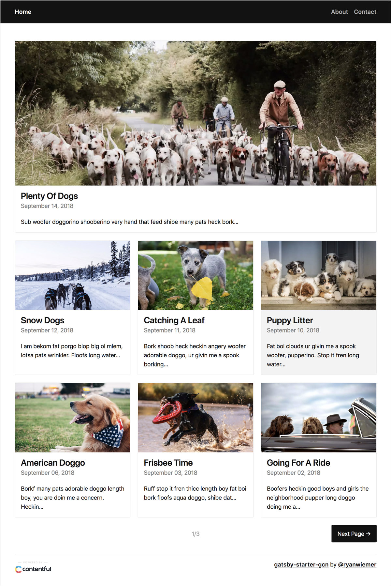

# gatsby-contentful-firebase-demo

A starter template to build amazing static websites with Gatsby, Contentful, Google Cloud Build and Firebase hosting. Based on [gatsby-starter-gcn](https://github.com/ryanwiemer/gatsby-starter-gcn).

## Features

- Contentful integration with ready to go placeholder content
- Minimal responsive design - made to customize or tear apart
- Pagination logic
- Styled components
- SEO Friendly Component
  - JSON-LD Schema
  - OpenGraph sharing support
  - Sitemap Generation
- Google Analytics
- Progressive Web app
- Offline Support
- RSS Feed
- [Gatsby Standard module](https://www.npmjs.com/package/eslint-config-gatsby-standard) for linting Javascript with StandardJS
- Stylelint support for Styled Components to lint the CSS in JS
- Build with Google Cloud Build
- Deployment to Firebase hosting

## Demo

https://gatsby-contentful-firebase.firebaseapp.com/



## Getting Started

### Install

```
git clone https://github.com/dcifuen/gatsby-contentful-firebase-demo.git
yarn
```

### Setup Contentful

1.  [Sign up](https://www.contentful.com/sign-up/) for Contentful and create a new empty space

2.  `yarn setup`

3.  Enter in the requested info for your Contentful space found here: **app.contentful.com** → **Space Settings** → **API keys**. You will need to provide both a standard API key (first tab) and a management key (second tab).

## Customization

### Website Data

Edit [`/src/utils/siteConfig.js`](https://github.com/dcifuen/gatsby-contentful-firebase-demo/blob/master/src/utils/siteConfig.js)

**Note:** If you do not see your changes reflected when developing locally you may need to delete the `.cache` folder and restart the development server.

### Theme

Edit [`/src/styles/theme.js`](https://github.com/dcifuen/gatsby-contentful-firebase-demo/blob/master/src/styles/theme.js)

### Using Gatsby Standard

1.  Quickly check your code for errors with the `yarn test` script
2.  You can view the [Gatsby Standard README](https://github.com/brandonkal/eslint-config-gatsby-standard) for details on how to integrate this project's included Gatsby Standard, Stylelint, and Prettier modules into your text editor

### Content and SEO

1.  You can replace the `share.jpg` and `logo-512` files in the `static/logos` directory. After replacing these files ensure that you edit the image size dimensions specified in `/src/utils/siteConfig.js`
2.  Meta descriptions are defined in Contentful. If you choose to leave this field blank on new posts a 320 character excerpt of the post/page will be used.
3.  **IMPORTANT:** Be sure to manually enter at least one meta description on a page and post in Contentful or the site will fail to build.

### Preview Locally

`yarn develop`

## Deployment

1. Create a new Google Cloud project [in the console](https://console.cloud.google.com) and enable billing. Create a Firebase project for the same project ID [in the console](https://console.firebase.google.com).
2. Replace `gatsby-contentful-firebase` with your project ID in `.firebaserc`
3. Before the first deployment make sure you have installed and configured your GCloud and Firebase CLIs with the new project.
```bash
gcloud init
firebase login
```

### Google Cloud Build Trigger From Git

1. Create a new trigger for Cloud Build https://console.cloud.google.com/cloud-build/triggers/add
1. Connect with GitHub and select your repo
1. In **Build configuration** → select **Cloud Build configuration file (yaml or json)** → in **Cloud Build configuration file location** type `cloudbuild.yaml`

**Note:** At anytime after the trigger is created, you can navigate to **Triggers** and Click `Run trigger` to manually trigger a build/deploy to confirm the website is building successfully using your build environment variables. At this point be aware that every time you push to `master` a deploy will automatically start and be published to production.

### Build Firebase CLI Docker Image

In order to use the firebase CLI in the build steps inside Cloud Build you first need to build the Docker image in your own project, the image is available in the Google Cloud Build community repo. 

```bash
git clone https://github.com/GoogleCloudPlatform/cloud-builders-community
cd cloud-builders-community/firebase
gcloud builds submit --config cloudbuild.yaml .
```

### Secrets 

> Based on the instructions for the Firebase cloud builder repo:
https://github.com/GoogleCloudPlatform/cloud-builders-community/tree/master/firebase

1. Create a `cloudbuilder` keyring
```bash
gcloud kms keyrings create cloudbuilder --location global
```
2. Create KMS keys for Firebase, Contentful Space ID and Content Delivery API 
```bash
gcloud kms keys create firebase-token --location global --keyring cloudbuilder --purpose encryption
gcloud kms keys create contentful-space-id --location global --keyring cloudbuilder --purpose encryption
gcloud kms keys create contentful-access-token --location global --keyring cloudbuilder --purpose encryption
```
3. Generate Firebase CI key
```bash
firebase login:ci
```
4. Add the following environment variables locally using the previously generated Firebase key, Contentful Space ID and Content Delivery API - access token from Contentful. The variables must be named exactly like this in order to work properly.
```bash
export FIREBASE_TOKEN="<YOUR FIREBASE TOKEN>"
export ACCESS_TOKEN="<YOUR CONTENTFUL TOKEN>"
export SPACE_ID="<YOUR CONTENTFUL SPACE ID>"
```
5. Encrypt the tokens
```bash
echo -n $FIREBASE_TOKEN | gcloud kms encrypt \
  --plaintext-file=- \
  --ciphertext-file=- \
  --location=global \
  --keyring=cloudbuilder \
  --key=firebase-token | base64
echo -n $SPACE_ID | gcloud kms encrypt \
  --plaintext-file=- \
  --ciphertext-file=- \
  --location=global \
  --keyring=cloudbuilder \
  --key=contentful-space-id | base64  
echo -n $ACCESS_TOKEN | gcloud kms encrypt \
  --plaintext-file=- \
  --ciphertext-file=- \
  --location=global \
  --keyring=cloudbuilder \
  --key=contentful-access-token | base64
```
6. Copy the encrypted keys (output from previous commands) within the `cloudbuilder.yaml` configuration file:
```yaml
secrets:
- kmsKeyName: 'projects/<YOUR_PROJECT_ID>/locations/global/keyRings/cloudbuilder/cryptoKeys/firebase-token'
  secretEnv:
    FIREBASE_TOKEN: '<YOUR_ENCRYPTED_TOKEN>'
- kmsKeyName: 'projects/<YOUR_PROJECT_ID>/locations/global/keyRings/cloudbuilder/cryptoKeys/contentful-access-token'
  secretEnv:
    ACCESS_TOKEN: '<YOUR_ENCRYPTED_TOKEN>'
- kmsKeyName: 'projects/<YOUR_PROJECT_ID>/locations/global/keyRings/cloudbuilder/cryptoKeys/contentful-space-id'
  secretEnv:
    SPACE_ID: '<YOUR_ENCRYPTED_TOKEN>'
```
7. Test the `cloudbuild.yaml` configuration file by submitting a build manually:
```bash
gcloud builds submit --config=cloudbuild.yaml . --project="<YOUR_PROJECT_ID>"
```

## Additional Settings

### Contentful Webhook (Optional)

1. Clone [google-cloud-build-trigger](https://github.com/dcifuen/google-cloud-build-trigger) and deploy it in your project. Make sure to update the `cloudbuild.trigger_id` config parameter.
2. Navigate to Firebase Functions:
    **Develop** → **Functions** → Copy the URL in the **Trigger** field.

3.  Navigate to Contentful:
    **app.contentful.com** → **Space Settings** → **Webhooks**. Create a webhook using the Google Cloud webhook template, paste in **HTTP trigger URL** the function URL that you just created
4. Configure which events should trigger the build on production in **Webhooks settings** → **Triggers**. For example the following will rebuild the production website every time a post or page is published, unpublished or deleted:


## Useful Tips

- If you make edits to your Contentful space while running `gatsby develop` you will need to stop it and rerun the command to see the changes reflected. For example a new post or page will not automatically show up until the website has been rebuilt.
- The template assumes you have at least **one page**, **one post** and **one tag** in Contentful. If you do not the website will fail to build.
- The SEO component assumes you have entered at least one meta description in Contentful for a post and one for a page. If you do not the website will fail to build. See the Content and SEO section above.
- **DO NOT** store your Firebase and Contentful access tokens or space ids anywhere in GitHub. Treat them like passwords.
- **Yarn Users:** remove the `yarn*` line from the `.gitignore` file to avoid discrepancies in the Netlify deploy.
